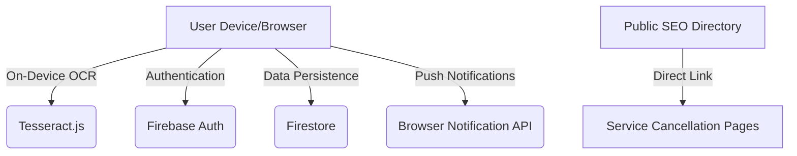

# TrialGuard: Zero-Dollar Blueprint & System Architecture

## 1. Project Mission
TrialGuard is a privacy-first utility designed to solve "Subscription Fatigue." By performing OCR (Optical Character Recognition) directly on the user's device, we ensure that sensitive financial or personal data never leaves the browser, providing a high-privacy alternative to apps like Rocket Money.

---

## 2. System Architecture (High Level)

### Flowchart: Adding a Trial via OCR
1. **User** clicks "Scan" and picks a photo (e.g., a "Welcome" email screenshot).
2. **Tesseract.js worker** spawns in a background thread within the browser.
3. **Regex Engine** scans text for service names (e.g., "Netflix") and trial keywords ("7 days", "Free").
4. **UI** pre-fills form fields derived from text.
5. **User** saves; data is encrypted/synced to **Firestore**.

---

## 3. Data Structure (Firestore)
- `/users/{uid}`: Profile and notification preferences.
- `/trials/{trialId}`:
    - `serviceName`: String
    - `startDate`: Timestamp
    - `durationDays`: Int
    - `status`: ['active', 'cancelled', 'expired']
    - `cancelUrl`: String (Defaulted from `constants.ts`)

---

## 4. Marketing Strategy (The "Guerrilla" Playbook)
1. **The Lead Magnet**: A public-facing page `/directory` listing direct cancellation links for 100+ services. This ranks for "How to cancel [Service]" searches.
2. **The Hook**: "Zero-Server OCR." No bank links required.
3. **The Viral Factor**: A "Total Saved" counter on the dashboard to encourage social sharing.

---

## 5. Futuristic Features (Phase 3+)
- **Smart Price Prediction**: Alert users if a price hike is detected in the OCR text.
- **Family Sharing**: Share trial alerts with household members.
- **Browser Extension**: Automatically detect "Start Trial" buttons on checkout pages and offer to track them.
